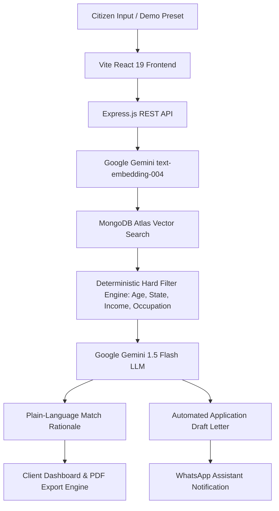

<div align="center">
  
  <h1>Setu AI (🏛️ सेतु AI)</h1>
  <p><strong>Bridging Indian Citizens to the Government Schemes They Deserve</strong></p>

  <p>
    <a href="https://setu-ai-six.vercel.app"></a>
  </p>

  <p>
    <a href="https://reactjs.org/"></a>
    <a href="https://www.typescriptlang.org/"></a>
    <a href="https://nodejs.org/"></a>
    <a href="https://www.mongodb.com/atlas"></a>
    <a href="https://deepmind.google/technologies/gemini/"></a>
    <a href="https://tailwindcss.com/"></a>
    <a href="LICENSE"></a>
  </p>

  <p>
    <a href="https://setu-ai-six.vercel.app"><strong>🌐 Try Live Production App: https://setu-ai-six.vercel.app</strong></a>
  </p>
</div>

---

## 📌 Overview

Setu AI is an **AI-powered Government Scheme Discovery Platform** built using **Hybrid Retrieval-Augmented Generation (Hybrid RAG)** for explainable and trustworthy welfare recommendations. It bridges the gap between 86+ complex government scheme guidelines and millions of eligible Indian citizens.

🏆 **Built for Lenovo Leap Hackathon 2026**

---

## 📸 Screenshots

| 🏠 Landing Page | 👤 Citizen Profile Wizard | 🎯 Scheme Results & AI Rationale |
| :---: | :---: | :---: |
| *(Add `docs/landing.png` here)* | *(Add `docs/profile.png` here)* | *(Add `docs/results.png` here)* |

| 🧪 Eligibility Simulator | 📄 AI Application Draft & PDF | 💬 WhatsApp Assistant |
| :---: | :---: | :---: |
| *(Add `docs/simulator.png` here)* | *(Add `docs/draft.png` here)* | *(Add `docs/whatsapp.png` here)* |

---

## 📖 The Problem

Millions of Indian citizens fail to receive government welfare benefits due to:
1. **Information Asymmetry**: Scheme criteria are buried across hundreds of fragmented state portals and 50-page PDFs.
2. **Dense Legal Language**: Eligibility constraints are written in complex bureaucratic jargon.
3. **Application Friction & Hallucination**: Generic search engines recommend schemes that citizens fail hard constraints for, wasting days of application effort.

---

## 🟢 The Solution & Architecture

Setu AI translates complex legal requirements into plain-language actionable recommendations via a 4-tier **Hybrid RAG Pipeline**:

```
Deterministic Hard Filters
           ↓
Gemini 768-dim Embeddings
           ↓
MongoDB Atlas Vector Search ($vectorSearch)
           ↓
Explainable AI (Gemini 1.5 Flash)
```

### 🗺️ System Architecture Diagram



---

## ✨ Features & Status

| Feature | Status | Description |
| :--- | :---: | :--- |
| **Hybrid RAG Matching** | ✅ | Combines MongoDB `$vectorSearch` with hard filter constraint rules so AI **never hallucinates** eligibility. |
| **86 Verified Schemes** | ✅ | Indexed across Agriculture, Education, Women Empowerment, Health, and Business Aid. |
| **Explainable AI Rationale** | ✅ | Gemini 1.5 Flash provides plain-language reasons *why* a citizen qualifies for each scheme. |
| **AI Application Drafts** | ✅ | Generates formatted official application letters with mandatory document checklists. |
| **Instant PDF Export** | ✅ | Native client-side A4 PDF generation using `html2canvas` & `jsPDF`. |
| **WhatsApp Assistant** | ✅ | Interactive Sandbox connection modal (`join solve-motor`) with copy buttons & WhatsApp deep links. |
| **Eligibility Simulator** | ✅ | Sandbox testing environment to preview how life events (income, state change) adjust eligibility. |
| **Compare Schemes** | ✅ | Side-by-side comparison on benefit values, deadlines, funding agencies, and required documents. |
| **Command Palette (`⌘K`)** | ✅ | Keyboard-driven quick navigation overlay across all portal routes. |
| **Privacy & Consent** | ✅ | DPDP compliant explicit user consent, hard-delete rights, and sandboxed LLM calls. |

---

## 🚀 Deployment

- **Frontend Application**: [https://setu-ai-six.vercel.app](https://setu-ai-six.vercel.app) (Vercel)
- **Backend API Server**: Node.js & Express API (Render / Railway)
- **Database & Search**: MongoDB Atlas Vector Search
- **Continuous Integration**: GitHub Actions CI/CD

---

## 🛠️ Tech Stack

### Frontend
- **Framework**: React 19 + TypeScript 5
- **Build Tool**: Vite 8
- **Styling**: Tailwind CSS v4 with custom tokens
- **Animations**: Framer Motion
- **Exports**: `html2canvas` & `jsPDF`

### Backend
- **Runtime**: Node.js 20 & Express + TypeScript
- **Database**: MongoDB Atlas Mongoose + `$vectorSearch` (768-dim embeddings)
- **AI Services**: Google Gemini SDK (`text-embedding-004` & `gemini-1.5-flash`)
- **Security**: JWT authorization, Bcrypt, CORS, Helmet

---

## 📁 Project Structure

```
setu-ai/
├── client/                     # Frontend Vite React 19 Application
│   ├── public/                 # Static assets & favicon
│   └── src/
│       ├── components/
│       │   ├── effects/        # CustomCursor, Reveal, MagneticButton, TiltCard
│       │   ├── layout/         # Header (Floating Glass Pill), Footer, BottomBar
│       │   ├── Profile/        # Profile wizard step forms
│       │   ├── ui/             # SearchableSelect, CommandPalette, Modal, Button
│       │   └── widgets/        # WhatsAppWidget Assistant
│       ├── context/            # AuthContext global state
│       ├── data/               # indiaLocations.ts (28 States + 8 UTs)
│       ├── pages/              # Landing, Profile, Results, Simulator, Draft, Compare
│       ├── router/             # AppRouter & AnimatedRoutes with scroll reset
│       ├── services/           # REST API client services
│       └── utils/              # Validation, benefit parsers
└── server/                     # Backend Express API Server
    └── src/
        ├── config/             # DB & Env configuration
        ├── controllers/        # Auth, Match, Explain, Draft, Simulator controllers
        ├── data/               # schemes.json (86 verified government schemes)
        ├── middleware/         # Auth JWT verification middleware
        ├── models/             # Mongoose Schemas (User, Scheme, Match, Reminder)
        ├── routes/             # REST route definitions
        ├── scripts/            # Database seed & Gemini embedding generation
        ├── services/           # Hybrid matchingService, draftService, aiExplanation
        └── utils/              # Hash, JWT token generators, cache
```

---

## ⚙️ Local Development Setup

### 1. Prerequisites
- Node.js (v18+)
- MongoDB Atlas cluster with a `$vectorSearch` index created on `schemes` collection.

### 2. Environment Configuration

Create `.env` files in both `client/` and `server/` directories:

**client/.env**
```env
VITE_API_URL=http://localhost:5000
```

**server/.env**
```env
PORT=5000
MONGO_URI=your_mongodb_atlas_connection_string
JWT_SECRET=your_jwt_secret_key
CLIENT_URL=http://localhost:5173
GEMINI_API_KEY=your_google_gemini_api_key
TWILIO_ACCOUNT_SID=your_twilio_account_sid
TWILIO_AUTH_TOKEN=your_twilio_auth_token
TWILIO_WHATSAPP_NUMBER=whatsapp:+14155238886
```

### 3. Install & Run Server
```bash
cd server
npm install
npm run dev
```

To seed the 86 verified government schemes & generate Gemini vector embeddings:
```bash
npm run seed
npm run embeddings
```

### 4. Install & Run Client
```bash
cd client
npm install
npm run dev
```
Open [http://localhost:5173](http://localhost:5173) in your browser.

---

## 🗺️ Future Scope & Roadmap

1. 🏛️ **Direct Government Portal & DigiLocker API Integration**: Automatic document verification (Aadhaar, Ration Cards, Income Certificates) via official India Stack APIs.
2. 🎙️ **Vernacular Voice Agent (Voice RAG)**: Multilingual speech-to-text in Hindi, Bhojpuri, Tamil, Marathi, and Bengali.
3. 📊 **Civic Welfare Analytics Dashboard**: B2G policy insights for district magistrates to track unmet welfare demand.
4. 🔔 **Proactive Subsidy Renewal Cron Alerts**: Automated WhatsApp notifications before scheme application deadlines close.

---

## 📄 License

Distributed under the MIT License. See `LICENSE` for details.

---

## 🙏 Acknowledgements

- **Google Gemini API**: For `text-embedding-004` and `gemini-1.5-flash` intelligence.
- **MongoDB Atlas**: For native Vector Search index support.
- **Twilio**: For WhatsApp messaging sandbox integration.
- **Vercel & Render**: For cloud hosting & deployment.
- **Government of India (myScheme.gov.in)**: For open welfare criteria reference data.

---

## 👨‍💻 Creators

Built with ❤️ for **Lenovo Leap Hackathon 2026** by:
- **Sparsh Gahoi** — [LinkedIn](https://www.linkedin.com/in/sparsh-gahoi-05a212342/)
- **Yash Saxena** — [LinkedIn](https://www.linkedin.com/in/yash-saxena-21490a308/)
