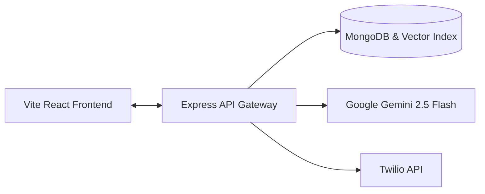

<div align="center">
  
  <h1>Setu AI</h1>
  <p><strong>Bridging Citizens to the Government Schemes They Deserve</strong></p>
  
  <p>
    <a href="https://setu-ai-six.vercel.app"></a>
  </p>
  
  <p>
    <a href="https://setu-ai-six.vercel.app"><strong>🌐 Try Live Production App: https://setu-ai-six.vercel.app</strong></a>
  </p>

  <p>
    <a href="https://reactjs.org/"></a>
    <a href="https://vitejs.dev/"></a>
    <a href="https://tailwindcss.com/"></a>
    <a href="https://www.typescriptlang.org/"></a>
    <a href="https://deepmind.google/technologies/gemini/"></a>
  </p>
</div>

---

Setu AI is a premium, production-grade civic-tech platform designed to bridge the gap between complex eligibility guidelines and the citizens who need welfare benefits the most. Built with a focus on privacy, simplicity, and speed.

🏆 **Built for the Lenovo Leap Hackathon 2026**

## 📖 The Problem

Millions of citizens miss out on essential welfare schemes because:
1. **Information Fragmentation**: Guidelines are spread across hundreds of confusing state directories.
2. **Textual Complexity**: Legal criteria and eligibility constraints are written in dense bureaucratic language.
3. **Application Friction**: Finding the right documents and formatting cover letters require physical visits to local centers.

## 🟢 The Solution

Setu AI translates complex legal requirements into simple, actionable steps using RAG (Retrieval-Augmented Generation) technology.

### 🌟 Key Features
- **RAG-powered Hybrid Eligibility Engine**: Setu AI uses exact vector matches and strict constraint filters (Age, Income, Location) so the AI **never hallucinates** eligibility.
- **Official Document Checks**: Automatically calculates exactly what paperwork you need to prepare (Aadhaar, Income Certificates, etc.).
- **Eligibility Simulator Sandbox**: Real-time simulation of life events (e.g. changing income, moving states) to see how scheme eligibility adjusts.
- **AI Application Drafts & WhatsApp Delivery**: Get high-quality application drafts in a built-in Google Docs style editor. Export immediately to PDF or receive matches directly on WhatsApp.
- **Privacy First (DPDP Compliant)**: Only collects required data, enforces explicit consent, guarantees a hard-delete right, and uses sandboxed prompt-injection safe LLM calls.

---

## 🛠️ Tech Stack & Architecture

Setu AI employs a decoupled Client-Server architecture for maximum security and performance.



### Frontend
- **Framework**: React 19 + TypeScript
- **Bundler**: Vite
- **Styling**: Tailwind CSS v4 with a custom premium design system
- **Animations**: Framer Motion
- **Utilities**: `html2canvas` & `jsPDF` for native draft exports

### Backend
- **Runtime**: Node.js & Express + TypeScript
- **Database**: MongoDB (Mongoose) with Vector Search indices
- **AI Engine**: Google Gemini SDK (`gemini-2.5-flash`)
- **Security**: Helmet, CORS, JWT session authorization, Bcrypt

---

## ⚙️ Local Development Setup

To run this project locally on your machine, follow these steps.

### Prerequisites
- Node.js (v18+)
- MongoDB instance (local or Atlas) with a Vector Index

### 1. Environment Configuration

Create a `.env` file in both `client/` and `server/` directories.

**client/.env**
```env
VITE_API_URL=http://localhost:5000
```

**server/.env**
```env
PORT=5000
MONGO_URI=mongodb://localhost:27017/setu-ai
JWT_SECRET=your_jwt_secret_key
CLIENT_URL=http://localhost:5173
GEMINI_API_KEY=your_gemini_key
TWILIO_ACCOUNT_SID=your_twilio_sid
TWILIO_AUTH_TOKEN=your_twilio_token
TWILIO_WHATSAPP_NUMBER=whatsapp:+14155238886
```

### 2. Run Backend & Seed Data
```bash
cd server
npm install
npm run dev
```
In a separate terminal (to load the scheme database):
```bash
cd server
npm run seed
npm run embeddings
```

### 3. Run Frontend
```bash
cd client
npm install
npm run dev
```
Open [http://localhost:5173](http://localhost:5173) in your browser.

---

## 🗺️ Roadmap
- [ ] **Multimodal Document OCR**: Upload Ration Cards to instantly pre-fill forms using Gemini Vision.
- [ ] **Regional Language Translation**: Translate complex guidelines into Tamil, Telugu, and Bengali.
- [ ] **Proactive Cron Alerts**: WhatsApp notifications for new schemes as they get announced.

---

## 👨‍💻 Creators

Built with ❤️ by:
- **Sparsh Gahoi** - [LinkedIn](https://www.linkedin.com/in/sparsh-gahoi-05a212342/)
- **Yash Saxena** - [LinkedIn](https://www.linkedin.com/in/yash-saxena-21490a308/)
